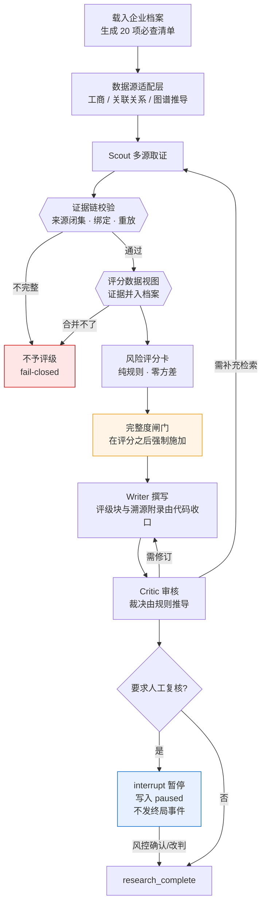

# 尽调智核 · DueDiligence Copilot

> 面向供应链金融 / 小额贷款 / 商业保理的**贷前企业尽职调查系统**。
>
> 一句话：**在一个不允许幻觉的业务场景里，把大模型的不确定性工程化地控制住。**

业务员发起一笔授信申请，系统对借款企业完成多源信息核查，产出《贷前尽职调查报告》，
标注每一条结论的来源与取证时间，给出**规则可解释**的风险评级与授信额度建议，
高风险结论暂停等待风控人员确认后才能出具。

---

## 这个项目真正在解决的问题

尽调场景的容错率极低。报告里一句编造的「该企业无涉诉记录」就可能导致坏账。
所以核心技术问题不是"让大模型写长报告"，而是三件事：

| 问题 | 这个项目的答案 |
|---|---|
| 模型会把**查不到**写成**没有** | 清单驱动 + 四态状态机 + 完整度闸门 |
| 结论**无法追责** | 来源闭集 + 结构化证据链 + 报告内溯源附录 |
| 改了之后**不知道有没有变好** | 两层评测 + 消融实验 + 独立盲测集 |

第三条是前两条的前提。这个项目里**每一个"有效"的结论都有数据**，
也因此**推翻过自己三次**（见下）。

### 一条不可让步的语义

```
「经查询，无失信记录」  = 已核实的正面结论，可支持授信
「失信记录未核实」      = 必须补查的信息缺口
```

二者混淆会直接误导信贷审批。系统里这条区分贯穿数据源层（`coverage.queried`）、
状态机、评分卡、报告渲染四层，并有专门的断言与评测指标。

---

## 诚实前提

- **本项目没有真实甲方**，是自驱项目。业务约束来自公开的信贷业务资料，
  不虚构委托方——履历造假的代价远高于收益。
- 代码基于一个**课程项目二次开发（已获授权）**。原项目是"行业信息研究助手"，
  本项目重写了场景、核心机制与评测体系；原始版权声明保留在文件头中。
- 数据源为**虚构的模拟数据**。企业名、信用代码、财务与司法记录均系编造，
  设计上刻意保留了缺口与冲突用于验证系统行为。

真实性靠的是**业务约束的真实**，不是甲方的真实：

| 约束 | 业务原因 | 技术后果 |
|---|---|---|
| 每个结论必须可溯源 | 出坏账要追责 | 证据链 + 报告溯源附录 |
| 取不到的必须标「未核实」 | 不能让模型编造 | 显式四态状态机 |
| 高风险结论必须人工确认 | 风控合规 | LangGraph `interrupt` 中断/恢复 |
| 全流程留痕 | 事后审计 | 证据编号可回查原始返回 |

---

## 系统怎么跑



三处刻意的设计，都在图上：

- **红色是 fail-closed 出口**。证据链断了、证据并不进评分数据，一律不予评级——
  不是给一个保守的分数
- **闸门在评分之后**，不可被评分覆盖
- **暂停不发终局事件**。只等 `research_complete` 的调用方，永远不会把一份
  未经复核的结论当成可用结论

### 证据的来源是闭集

| `verification_origin` | 重放依据 | 谁能产生 |
|---|---|---|
| `initial_profile` | 从企业档案重放（复用同一套字段映射） | 档案加载 |
| `structured_adapter` | 从 `evidence_store` 按 `evidence_ids` 回查比对 | **仅限注册表内的适配器** |
| 缺失（旧检查点） | 默认不予采信 | — |

通用网页检索**不在集合内**。它产出自然语言，没有稳定的字段映射，
也无法在重放时比对取值——它可以作为 LLM 的阅读素材，但不能让任何字段变成"已核实"。

---

## 真实产出长什么样

以下是评测企业 EVAL-002（虚构）的**真实生成结果**，非手写示意。
该企业存在失信记录、资产负债率 89.1%、现金流为负，且涉入担保圈。

**风险评级块**（由规则引擎生成，撰写环节改写会被代码重建）：

```
| 风险等级     | **拒绝**                          |
| 综合评分     | 93.9 / 100（⚠️ 不可单独使用，以等级与闸门为准）|
| 必查项核实率 | 15/15（100%）                     |
| 人工复核     | 必须                              |

触发的完整度闸门
- operation 维度核实率不足 50%，不参与加权且等级下限提升
- 存在失信被执行人记录，等级下限提升至高风险（一票否决类）
```

**授信额度建议**（多口径取最小，只用已核实的财务数据）：

```
- 不出具额度建议：风险等级为拒绝

| 测算口径   | 金额（万元） | 依据                                          |
| 营收法     | 1960       | 2025年度营业收入 9800 万元 × 20%               |
| 现金流法   | 0          | 经营性现金流净额 -2870 万元，为负，本口径不支持任何授信额度 |

放款条件与增信要求
- 对外担保 2 笔合计 4000 万元属或有负债，须持续监控被担保方履约情况
- 其中 2 笔未见股东会决议，须补充内部决议文件后方可放款
- 已查实涉入担保圈，须要求企业限期解除互保关系，或按环上敞口全额计提风险准备
- 本笔评级要求人工复核，未经复核不得放款
```

> 「不出具额度」本身也是一个需要依据的结论——所以测算底稿照样列出。

**担保圈推导结果**（关联关系图谱，非模型判断）：

```
连环担保：郑州宏川物流供应链 → 郑州宏川仓储管理 → 洛阳通达运输 → 郑州宏川物流供应链
         （环上担保合计 6200 万元）
互保：    郑州宏川物流供应链 → 洛阳通达运输 → 郑州宏川物流供应链
         （环上担保合计 3600 万元）
```

**证据溯源附录**（报告末尾，供事后审计与追责）：

```
| 核查项   | 结论                          | 来源           | 取证时间   | 证据编号                    |
| 登记状态 | 存续                          | 初始企业档案    | 2026-08-10 | —                          |
| 对外投资 | 郑州宏川仓储管理有限公司 持股60% | 关联关系登记库  | 2026-08-11 | ev_external_investment_00d8…|
| 担保圈   | 连环担保：郑州宏川物流 → …      | 关联关系图谱推导 | 2026-08-11 | ev_guarantee_circle_2d2978d9|

尚未核实的项（信息缺口，非「不存在」）
| 核查项   | 必查 | 未核实原因           |
| 中标记录 | 否   | 本次未查询招投标记录  |
> ⚠️ 以上各项未取得核实结论，不得解读为「不存在」或「无记录」。
> 两者在授信判断上的含义完全相反。
```

---

## 核心机制

### 1. 清单驱动，把缺失变成显式数据

```
自由生成：搜索 → 提取 → 写报告            缺失是静默的
清单驱动：20 项必查清单 → 逐项核查 → 写报告  缺失是显式的、可计数的
```

状态机四态：`verified` / `unverified` / `conflicting` / `not_applicable`，
由数据源判定，模型只负责表述、不负责判断有没有。

### 2. 完整度闸门：查不到 ≠ 没问题

最危险的失效模式是：司法数据源故障 → 三项必查全部未核实 → 司法维度无扣分
→ 综合分很低 → 输出「低风险，建议授信」。

闸门在综合评分**之后**强制施加、不可被评分覆盖。实测五家评测企业中
**四家的等级由闸门而非分数决定**——闸门不是补充规则，是主要判据。

> 综合分会被"表现好"的维度稀释：一家已列入失信名单、资产负债率 89.1%、
> 连续亏损的企业综合分仅 47.5（落在中风险区间）。真正挡住它的是
> 「失信 → 至少高风险」这条硬规则。**综合分不可单独使用。**

### 3. 结构化证据链：通过校验 ≠ 进入评分

每条已核实结论携带 `verification_origin` / `source_adapter` / `retrieved_at` /
`evidence_ids`。来源与适配器**都是闭集**，通用网页检索不在其中——
自然语言事实无法承担字段级核实，它没有稳定的字段映射，也无法在重放时比对取值。

四条锁死的规则，每条都有反向断言：

1. `attempted_sources` 不是证据——只说明尝试过
2. 通用网页检索不是结构化核实来源
3. 来源不明不得静默猜测，且不得继续形成自动授信等级
4. **通过校验 ≠ 进入评分**——证据必须能并进评分卡真正读的那份数据

第 4 条是最贵的一条教训：证据链校验全绿，评分卡却仍从旧档案取值，
把「存在 1800 万元对外担保」读成「未发现对外担保」。
**一条新增的负面证据被翻译成了有利于放款的结论。**

### 4. 担保圈图谱推导：未发现 ≠ 不存在

从关联关系图检测互保与连环担保。但推导的"未发现"**只和图的完整性一样强**：

| 情形 | 结论 |
|---|---|
| 主体无对外担保 | 确定性地不涉入（无出边则无环，不依赖图完整性） |
| 遍历闭合且无环 | 未发现担保圈 |
| **对手方不在库中** | **无法判定**，保持信息缺口 |

### 5. 人机协同：暂停不等于完成

风险评级要求人工复核时，流程在 `human_review` 节点 `interrupt`，
写入 `paused` 状态并**拒绝发出终局事件**——暂停意味着这份结论还没有效力。

复核人**可以**推翻规则引擎的等级（规则永远覆盖不全），但规则引擎的原始等级
永远保留，调整作为一条闸门写进报告，且必须署名。
**改写而不留痕，出坏账追责时无法区分"规则算错了"和"人改过了"。**

---

## 可评测：这个项目最花力气的部分

### 两层评测

| 层 | 是否调 LLM | 耗时 | 用途 |
|---|---|---|---|
| 快速层 `run_fast.py` | 否 | 秒级 | 字段状态 / 无记录识别 / 主体异常 / 核实率 / 等级 / 闸门理由 / 证据链 |
| 校验层 `run_critic.py` | 是 | ~8 分钟 | Critic 检出率与误报率，每例重复 3 次做方差分离 |

方差分离是必需的：单次口径会把 7 个"方差"误读成缺陷。

### 三次推翻自己

这个项目的评测能力，价值在于它**推翻过自己发布的结论**：

| 曾经的结论 | 实情 |
|---|---|
| "提示词禁止无效，代码兜底才有效（4/18→9/18）" | 评测调的是 `_review_content()`，而代码过滤在 `process()` 里——**评测从未走过那条路径**，归因错误 |
| "扫描器贡献 +6.7 个百分点" | 消融开关只绕过结果合并，扫描结论仍被写进提示词——**消融组的模型依然看得到**，数字无效 |
| "确定性扫描器消除尾部风险" | 见下 |

### 一个被自己删掉的功能

正则扫描器在开发集上是正贡献，在**两次独立盲测集上都是负贡献**：

```
v3 消融（开发集）  A 完整 100%/5.6%    B 关扫描器 96.7%/7.5%   ← 正贡献
v2 盲测            A 63.9%/36.1%       B 71.4%/8.3%            ← 负贡献
v4 盲测            A 83.3%/33.3%       B 95.2–97.6%/7.1%       ← 负贡献
```

逐用例比对：扫描器**独有贡献 0 例**，因"强制分工"被丢弃的正确检出 **4 例**。
开发集正、两次未见数据负，是过拟合的标准形态——词表与模板是照着开发集的
失败用例逐轮修出来的，最终记住的是开发集，不是中文。

**已连同 199 行实现与 29 条测试一并删除。**
删除后审核降级路径改为 fail-closed：审核未执行与审核通过必须区分。

> 这条经验的通用形式：**开集问题（"中文有多少种说法"）不要用枚举去解。**
> 后来修 Critic 裁决不一致时改用闭集规则（对已抽取的 issues 结构做判断），
> 纯函数可穷举单测，不需要盲测集。

---

## 工程实践

| | |
|---|---|
| 确定性断言 | **261** 条，14 个测试文件，秒级全跑完 |
| Bad case 记录 | **48** 条，每条含 现象 → 定位过程 → 根因 → 解决方案 → 举一反三 |
| 消融实验 | 4 组开发集 + 2 套独立盲测集，原始 JSONL 全部留档，数据集 SHA256 可核 |
| 后端代码 | 约 26,000 行 Python |

### 反复出现的两类缺陷（写进了方法论）

**① 机制实现了，但没有约束力。**
扫描器检出违规却不影响裁决；降级信息写进 `errors` 而 `errors` 不参与任何判定；
`warning` 里写着"仍有问题未解决"然后照常出厂。
判断一个机制是否生效，只看**它能否改变最终结果**。

**② 测试替身比真实实现能力更强。**
人机协同 23 条断言全绿并已提交，起容器做真实跨进程验证时第一步就炸：
测试注入的 `MemorySaver` 同步异步两套接口都实现，真正上生产的 `PostgresSaver`
只有同步一套。**替身能跑通的路径，真货跑不了。**
现已建立替身契约防线：替身能接受的调用，真货必须也接受。

---

## 演进路线

每个箭头都是一条真实的因果链，不是事后编的。

```
v0.1 最小闭环      → 预判"模型会编造"，实测没有发生，但无法度量生效率
v0.2 清单驱动      → 撞出「查了但无记录」≠「未查询」的设计漏洞
v0.3 反幻觉闸门    → 撞上一堵墙：改好没有？不知道
v0.4 让它可评测    → 转折点。不能度量就不能改进
v0.5 风险评分+闸门 → 发现高风险结论不该全自动放行
v0.6 人机协同      → 业务需求倒逼恢复被绕过的 LangGraph 编排
v0.7 数据源+图谱   → 证据链第一次处理非替身适配器；担保圈能力建成
v1.0 交付形态
```

完整演进日志与每轮的「预期 vs 实际」对照见 [`docs/ITERATION_ROADMAP.md`](docs/ITERATION_ROADMAP.md)，
其中包含多处**预判错误**的如实记录——预判错了本身就是有价值的信息。

### v0.6 的架构故事

接手时 `graph.py` 里有两套编排：声明式的 LangGraph 图与命令式的手写循环，
运行时只走后者，前者被整段注释。**问题不是"有段死代码"，而是死代码已经和活代码分叉了**——
声明式图的 analyze 节点只调图表 Agent，不调风险评分。
直接"取消注释恢复图执行"会静默丢掉整条风险评级链路。

做法是先给活着的路径录一条黄金轨迹（11 条逐事件断言），再重建图并比对，
最后删掉手写编排消除双份实现。业务上的「人在回路」需求是这次重构的动机，
不是"看到死代码手痒"。

---

## 快速开始

模拟数据源开箱即用，**无需任何付费 API Key** 即可跑通完整流程。

```bash
docker compose up -d
```
```bash
cd backend && pip install -r requirements.txt && python app/app_main.py
```
```bash
cd frontend && npm install && npm run dev
```

跑确定性回归（秒级，不调 LLM、不连外部服务）：

```bash
cd backend && python eval/run_fast.py
```

| 服务 | 地址 |
|---|---|
| 后端 API | http://localhost:8000 ，文档 `/docs` |
| 前端 | http://localhost:5183 |

需要 LLM 的完整研究流程另需在 `backend/.env` 配置 `DASHSCOPE_API_KEY`。

---

## 技术栈

FastAPI · LangGraph 1.2（真实图执行 + `interrupt` 人机协同 + `get_stream_writer` 实时 SSE）
· PostgreSQL（业务数据 + 图检查点）· Redis · Milvus · MinIO · React + TypeScript

---

## 文档

| 文档 | 内容 |
|---|---|
| [`docs/DESIGN_CORE_MECHANISMS.md`](docs/DESIGN_CORE_MECHANISMS.md) | 核查清单 / 未核实机制 / 风险评分卡 / 证据链的设计与取舍 |
| [`docs/BADCASES.md`](docs/BADCASES.md) | 48 条缺陷记录，含定位过程与举一反三 |
| [`docs/ITERATION_ROADMAP.md`](docs/ITERATION_ROADMAP.md) | 演进日志，每轮的预期与实际对照 |
| [`docs/V1_VS_V2_BASELINE.md`](docs/V1_VS_V2_BASELINE.md) | 接手时单链路 vs 多智能体的一手实测对比 |
| [`backend/eval/`](backend/eval/) | 评测装置、消融实验报告、原始 JSONL |

---

## 当前状态与已知限制

诚实记录，不修饰：

- **Critic 的检出质量尚未封板。** 裁决一致性已用规则解决，但"能不能发现问题"
  需要新的未见盲测集才能重新度量——两套盲测集都已用掉并退役为回归集。
- **数据源全部为模拟实现。** 真实适配器按同一基类接入即可，但需要付费 Key。
- 前端仍为原项目形态，尽调专用页面（担保圈可视化、溯源交互）尚未完成。
- 一次完整研究约 834 秒。当前优先保证报告质量与决策正确性，未做性能优化。

---

## 许可与致谢

本项目基于一个课程项目二次开发，**已获得原作者授权**。
原始版权声明保留在各源文件头部，本次迭代新增与改造部分由 [@XbhbxZty](https://github.com/XbhbxZty) 署名。
