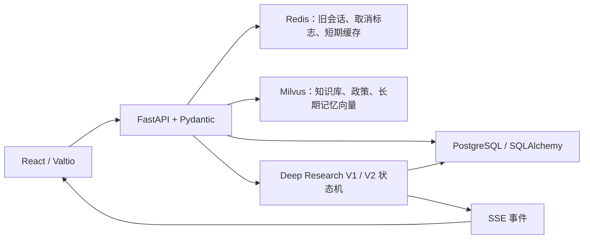
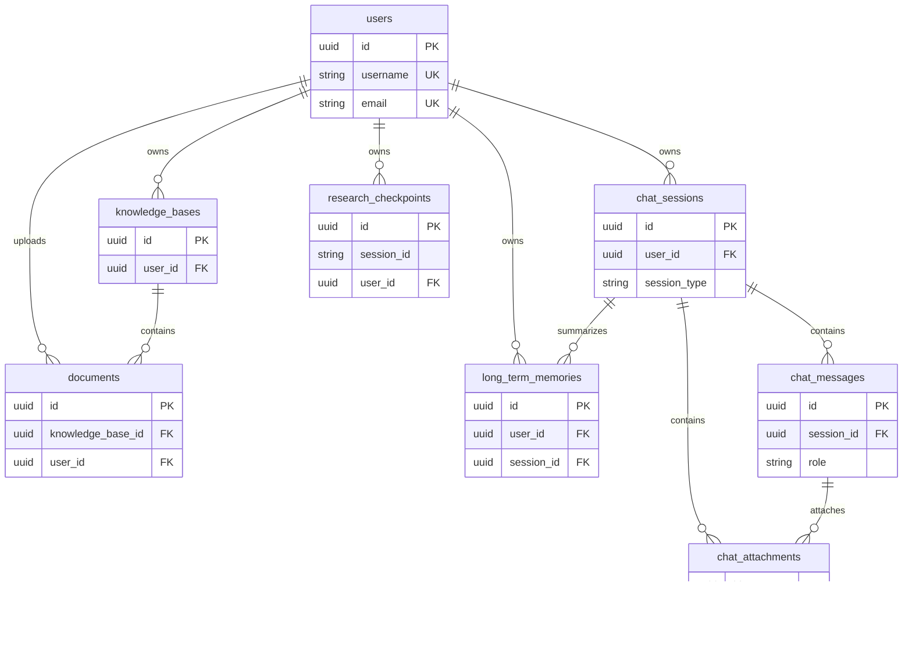
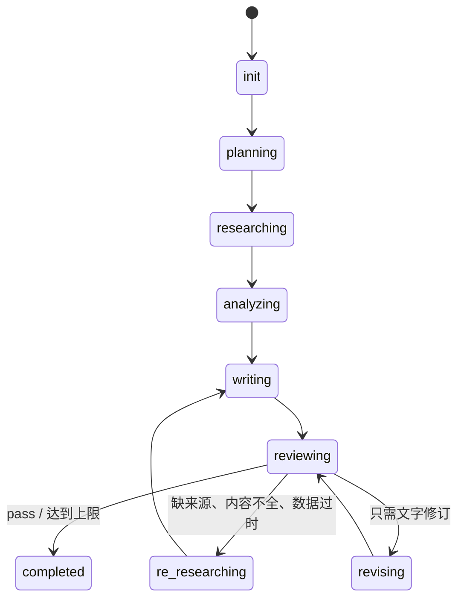

# 项目数据结构总览

> 目标：阅读代码时，可以从“字段长什么样”快速定位到“存在哪里、由谁创建、经过哪个接口、前端用什么类型接收”。
>
> 覆盖范围：PostgreSQL ORM、Redis、Milvus、Pydantic API Schema、后端 dataclass / TypedDict / Enum、Deep Research V1/V2 运行时字典与 SSE 事件、前端 API 类型、Valtio Store、核心 UI 数据结构。纯行为型 Service 类和只在单个函数内短暂存在的普通局部变量不逐一列出。

## 1. 先建立全局认识

项目里有四条主要数据链：



阅读时首先区分以下几组容易混淆的结构：

| 名称/领域 | 实际存在的版本 | 主要位置 |
|---|---|---|
| 会话 | PostgreSQL 新版 `ChatSession/ChatMessage`；Redis 旧版 `session:*` / `message:*` | `models/chat.py`、`service/session_service.py` |
| 深度研究 | V1 `ReActContext`；V2 `ResearchState` + LangGraph | `service/react_controller.py`、`service/deep_research_v2/state.py` |
| 文档 | 新知识库文档 `models.Document`；旧 `/documents` 接口的 DocMind 文档字典 | `models/knowledge.py`、`schemas/document.py` |
| 图表 | 通用 ECharts `ChartConfig`；V2 ECharts 图表；V2 Python/base64 图表 | 后端多个 service、前端多个 `ChartConfig` |
| 行业配置 | 后端 snake_case；前端 camelCase，且分别维护常量 | `config/industry_config.py`、`store/industry.ts` |

## 2. PostgreSQL 持久化模型（14 张表）

定义集中在 [`backend/app/models`](../backend/app/models)。主键基本都是 PostgreSQL UUID；时间字段使用 `datetime.utcnow`。

### 2.1 实体关系



`industry_news`、`bidding_info`、`news_collection_tasks`、`industry_stats`、`company_data`、`policy_data` 当前没有 ORM 外键关系，是独立业务表。

### 2.2 用户与聊天

#### `User` → `users`

来源：[`backend/app/models/user.py`](../backend/app/models/user.py)

| 字段 | 类型/约束 | 含义 |
|---|---|---|
| `id` | UUID，PK | 用户 ID |
| `username` | String(50)，unique，非空，index | 用户名 |
| `email` | String(100)，unique，非空，index | 邮箱 |
| `hashed_password` | String(255)，非空 | 密码哈希，绝不能直接返回前端 |
| `is_active` | Boolean，默认 true | 是否启用 |
| `is_superuser` | Boolean，默认 false | 是否超级用户 |
| `created_at` / `updated_at` | DateTime | 创建/更新时间 |
| `sessions` | `List[ChatSession]` relationship | 级联删除 |
| `knowledge_bases` | `List[KnowledgeBase]` relationship | 级联删除 |
| `documents` | `List[Document]` relationship | 级联删除 |
| `memories` | `List[LongTermMemory]` relationship | 级联删除 |

#### `ChatSession` → `chat_sessions`

来源：[`backend/app/models/chat.py`](../backend/app/models/chat.py)

`id: UUID PK`；`user_id: UUID FK(users.id), CASCADE`；`title: String(255) = "新对话"`；`session_type: String(50) = "chat"`（约定值 `chat | deepsearch`）；`created_at`；`updated_at`。关系：`user`、`messages`、`memories`、`attachments`。

#### `ChatMessage` → `chat_messages`

`id: UUID PK`；`session_id: UUID FK(chat_sessions.id), CASCADE`；`role: String(20)`（`user | assistant | system`）；`content: Text`；`thinking: Text?`；`references_data: JSONB?`；`image_results: JSONB?`；`created_at`。关系：`session`、`attachments`。

`references_data` 和 `image_results` 没有更严格的数据库 Schema，实际协议由 API/前端约定。

#### `ChatAttachment` → `chat_attachments`

`id: UUID PK`；`message_id: UUID? FK(chat_messages.id), CASCADE`；`session_id: UUID FK(chat_sessions.id), CASCADE`；`user_id: UUID? FK(users.id), CASCADE`；`filename: String(255)`；`file_type: String(50)`；`file_size: BigInteger`；`file_path: String(500)`；`content_text: Text?`；`status: String(20) = pending`（`pending | processing | completed | failed`）；`error_message: Text?`；`created_at`；`updated_at`。

#### `LongTermMemory` → `long_term_memories`

`id: UUID PK`；`user_id: UUID FK(users.id), CASCADE`；`session_id: UUID? FK(chat_sessions.id), SET NULL`；`summary: Text`；`key_insights: JSONB?`；`milvus_ids: Text[]?`；`token_count: Integer?`；`created_at`。

其中 `key_insights` 实际保存的是完整总结对象，而不只是洞察数组：

```text
MemorySummary = {
  summary: str,
  key_insights: list[str],
  user_preferences: {
    interests: list[str],
    communication_style: str,
    focus_areas: list[str]
  },
  topics: list[str]
}
```

### 2.3 知识库

来源：[`backend/app/models/knowledge.py`](../backend/app/models/knowledge.py)

#### `KnowledgeBase` → `knowledge_bases`

`id: UUID PK`；`user_id: UUID FK(users.id), CASCADE`；`name: String(255)`；`description: Text?`；`document_count: Integer = 0`；`created_at`；`updated_at`。关系：`user`、`documents`（知识库删除时级联删除文档）。

#### `Document` → `documents`

`id: UUID PK`；`knowledge_base_id: UUID FK(knowledge_bases.id), CASCADE`；`user_id: UUID FK(users.id), CASCADE`；`filename: String(255)`；`file_type: String(50)?`；`file_size: BigInteger?`；`file_path: String(500)?`；`status: String(50) = pending`；`chunk_count: Integer = 0`；`error_message: Text?`；`created_at`；`updated_at`。

注意：切片正文和向量不在 PostgreSQL，而在名称形如 `kb_<知识库名>` 的 Milvus collection 中。

### 2.4 行业资讯与招投标

来源：[`backend/app/models/news.py`](../backend/app/models/news.py)

#### `IndustryNews` → `industry_news`

`id`；`industry_id: String(50), index`；`title: String(500)`；`content: Text?`；`source: String(200)?`；`source_url: Text?`；`category: String(50) = 新闻, index`（业务值常见 `政策 | 纪要 | 研报 | 新闻`）；`department: String(200)?`；`publish_time: DateTime?, index`；`collected_at`；`keywords: String(500)?`；`is_read: Boolean = false`；`created_at`；`updated_at`。

#### `BiddingInfo` → `bidding_info`

`id`；`industry_id`；`bid_id: String(100), unique, index`；`title`；`notice_type`（如招标/中标/采购）；`province`；`city`；`content`；`publish_time`；`source = "81api"`；`collected_at`；`is_read`；`created_at`；`updated_at`。

#### `NewsCollectionTask` → `news_collection_tasks`

`id`；`task_type: news | bidding`；`status: pending | running | completed | failed`；`total_collected`；`error_message`；`started_at`；`completed_at`；`created_at`。

### 2.5 Text2SQL 业务数据

来源：[`backend/app/models/industry_data.py`](../backend/app/models/industry_data.py)

#### `IndustryStats` → `industry_stats`

`id`；`industry_name`；`metric_name`；`metric_value: Float`；`unit`；`year`；`quarter`；`month`；`region = 全国`；`source`；`source_url`；`notes`；`created_at`；`updated_at`。

#### `CompanyData` → `company_data`

`id`；`company_name`；`stock_code`；`industry`；`sub_industry`；`revenue`；`net_profit`；`gross_margin`；`market_cap`；`employees`；`market_share`；`year`；`quarter`；`data_source`；`extra_data: JSONB?`；`created_at`；`updated_at`。

金额字段注释约定单位为“亿元”，比例字段约定为百分比。

#### `PolicyData` → `policy_data`

`id`；`policy_name`；`policy_number`；`department`；`level = 国家级`；`publish_date`；`effective_date`；`expiry_date`；`category`；`industry`；`summary`；`key_points: JSONB?`；`full_text_url`；`impact_level`（`重大 | 一般 | 轻微`）；`affected_entities: JSONB?`；`created_at`；`updated_at`。

### 2.6 深度研究检查点

来源：[`backend/app/models/research.py`](../backend/app/models/research.py)

#### `ResearchCheckpoint` → `research_checkpoints`

| 字段 | 类型 | 含义 |
|---|---|---|
| `id` | UUID PK | 检查点记录 ID |
| `session_id` | String(64)，index | 研究会话 ID；不是数据库外键 |
| `user_id` | UUID? FK(users.id) | 用户 |
| `query` | Text | 原始研究问题 |
| `phase` | String(32) | 当前研究阶段 |
| `iteration` | Integer | 审核/修订迭代次数 |
| `state_json` | JSONB | 完整后端 `ResearchState` |
| `ui_state_json` | JSONB? | 可恢复的前端 UI 状态 |
| `final_report` | Text? | 最终报告 |
| `status` | String(16) | `running | paused | completed | failed` |
| `error_message` | Text? | 错误信息 |
| `created_at` / `updated_at` | DateTime | 时间 |

## 3. 非 PostgreSQL 存储结构

### 3.1 Redis 旧版会话

来源：[`backend/app/service/session_service.py`](../backend/app/service/session_service.py)

| Redis key | 数据类型 | value 结构 |
|---|---|---|
| `session:{session_id}` | Hash | `session_id, created_at, updated_at, message_count` |
| `message:{session_id}:{message_id}` | Hash | `message_id, session_id, role, content, created_at` |
| `session:{session_id}:messages` | Sorted Set | member=`message_id`，score=`created_at` 时间戳 |

限制：最多保留 20 条消息；构建提示词时最多约 5000 token。这里的时间是整数 Unix timestamp，而 PostgreSQL 新会话 API 返回 ISO datetime。

### 3.2 Redis 通用 JSON 缓存与取消标志

来源：[`backend/app/core/redis_client.py`](../backend/app/core/redis_client.py)、[`backend/app/router/research_router.py`](../backend/app/router/research_router.py)

- 通用 `RedisCache.set()`：value 统一 `json.dumps` 后用 String 保存，默认 TTL 3600 秒。
- `research:cancel:{session_id}`：`{"cancelled": true}`，TTL 300 秒。
- `set_session()` 同样使用 `session:{session_id}`，但保存的是 JSON String；它与旧 `SessionService` 的同名 Redis Hash key 存在数据类型冲突风险，不应混用。
- `add_to_list(key, value)`：Redis List，元素是 JSON String，默认保留最近 100 项。

### 3.3 Milvus 知识库集合

来源：[`backend/app/service/milvus_service.py`](../backend/app/service/milvus_service.py)

collection 通常命名为 `kb_<知识库名>`，字段如下：

| 字段 | Milvus 类型 | 含义 |
|---|---|---|
| `id` | VARCHAR(64)，PK | 切片 ID |
| `doc_id` | VARCHAR(64) | PostgreSQL Document ID |
| `kb_id` | VARCHAR(128) | 知识库标识 |
| `filename` | VARCHAR(512) | 文件名 |
| `content` | VARCHAR(65535) | 切片文本 |
| `chunk_index` | INT64 | 切片序号 |
| `vector` | FLOAT_VECTOR(1024) | `text-embedding-v4` 向量 |

索引：`IVF_FLAT + COSINE`，`nlist=128`；查询 `nprobe=10`。搜索结果会额外带 `score`。

### 3.4 Milvus 长期记忆集合

固定 collection：`long_term_memories`。来源：[`backend/app/service/memory_service.py`](../backend/app/service/memory_service.py)

`id: VARCHAR(64) PK`；`user_id`；`session_id`；`memory_type: summary | insight | topics`；`content`；`metadata: JSON 字符串`；`vector: FLOAT_VECTOR(1024)`。

ID 约定：`{memory_id}_summary`、`{memory_id}_insight_{i}`、`{memory_id}_topics`。

### 3.5 Milvus 政策集合

默认 collection：`policy_documents`。来源：[`backend/app/service/policy_search_service.py`](../backend/app/service/policy_search_service.py)

`id: VARCHAR(64) PK`；`title: VARCHAR(1024)`；`website: VARCHAR(256)`；`entry_url: VARCHAR(1024)`；`detail_url: VARCHAR(1024)`；`date: VARCHAR(64)`；`content: VARCHAR(65535)`；`vector: FLOAT_VECTOR(1024)`。

## 4. 后端 API Schema（Pydantic）

### 4.1 认证

来源：[`backend/app/schemas/user.py`](../backend/app/schemas/user.py)、[`backend/app/core/security.py`](../backend/app/core/security.py)

| Schema | 字段 |
|---|---|
| `UserBase` | `username: str(3..50)`, `email: EmailStr` |
| `UserCreate extends UserBase` | `password: str(6..100)` |
| `UserLogin` | `username`, `password`；username 可填用户名或邮箱 |
| `UserResponse extends UserBase` | `id: UUID`, `is_active`, `created_at` |
| `UserInDB extends UserResponse` | `hashed_password`, `is_superuser`, `updated_at` |
| `TokenResponse` | `access_token`, `token_type="bearer"`, `user: UserResponse` |
| `PasswordChange` | `old_password`, `new_password` |
| `Token` | `access_token`, `token_type="bearer"` |
| `TokenData` | `user_id?`, `username?` |

### 4.2 新版会话、消息与附件

来源：[`backend/app/schemas/chat.py`](../backend/app/schemas/chat.py)

| Schema | 字段 |
|---|---|
| `SessionCreate` | `title?`, `session_type="chat"` |
| `SessionUpdate` | `title` |
| `SessionResponse` | `id, title, session_type, created_at, updated_at, message_count` |
| `SessionWithMessagesResponse` | SessionResponse + `messages: List[MessageResponse]` |
| `MessageCreate` | `role, content, thinking?, references_data?: Dict, image_results?: List[Dict]` |
| `MessageResponse` | MessageCreate + `id, session_id, created_at` |
| `AttachmentResponse` | `id, session_id, message_id?, filename, file_type, file_size, status, error_message?, created_at` |
| `AttachmentListResponse` | `attachments`, `total` |

对应端点：`/sessions`、`/sessions/{id}/messages`、`/attachments`。

### 4.3 旧聊天/流式聊天

| Schema | 字段/用途 |
|---|---|
| `LegacySessionResponse` | `session_id, created_at:int, updated_at:int, message_count`；Redis 旧会话 |
| `ChatRequest` | `session_id?, question, search_knowledge=true, search_web=true` |
| `ChatWithAttachmentsRequest` | ChatRequest + `attachment_ids?` |
| `RetrievedDocument` | `id, content, content_with_weight, source, title?, weight, link?` |
| `ChatResponse` | `role, content, thinking?: bool`；注意这里的 thinking 是 bool，而数据库字段是文本 |

### 4.4 知识库与文档

来源：[`backend/app/schemas/knowledge.py`](../backend/app/schemas/knowledge.py)

| Schema | 字段 |
|---|---|
| `KnowledgeBaseCreate` | `name`, `description?` |
| `KnowledgeBaseUpdate` | `name?`, `description?` |
| `KnowledgeBaseResponse` | `id, name, description?, document_count, created_at, updated_at` |
| `DocumentResponse` | `id, knowledge_base_id, filename, file_type?, file_size?, status, chunk_count, error_message?, created_at, updated_at` |
| `DocumentUploadResponse` | `status, id, filename, process_status, message` |
| `KnowledgeBaseWithDocuments` | KnowledgeBaseResponse + `documents` |

旧 `/documents` API 使用另一组同名/近似结构，来源：[`backend/app/schemas/document.py`](../backend/app/schemas/document.py)

| Schema | 字段 |
|---|---|
| `DeleteDocumentsRequest` | `document_ids` |
| `RetrieveDocumentsRequest` | `question, document_ids?` |
| `DocumentResponse`（旧） | `id, name, type, size, status?, run?, progress?, chunk_count?, token_count?, create_time?, update_time?, created_by?, index_name?, json_file_path?` |
| `ProcessingDetails` | `document_count, es_inserted, json_file_path`；`es_inserted` 是遗留命名，当前实现使用 Milvus |
| `UploadDocumentResponse` | `status, message, document?, document_id?, upload_response?, processing_details?` |
| `DocumentListResponse` | `code, data: Dict` |
| `DeleteDocumentsResponse` | `code, message, data: Dict` |

### 4.5 搜索

来源：[`backend/app/schemas/search.py`](../backend/app/schemas/search.py)

- `WebSearchRequest`：`query, gl="us", hl="en", autocorrect=true, page=1, search_type="search"`。
- `SearchResultItem`：`type, title?, link?, snippet?, position?, description?, source?, attributes?, question?, queries?`。
- `WebSearchResponse`：`success, message?, query, results, raw_results?`。

`SearchResultItem.type` 的实际分支：

| type | 专有字段 |
|---|---|
| `organic` | `title, link, snippet, position` |
| `knowledgeGraph` | `title, description, source, link, attributes` |
| `peopleAlsoAsk` | `question, snippet, title, link` |
| `relatedSearches` | `queries` |

### 4.6 数据库探索与 Text2SQL

来源：[`backend/app/router/database_router.py`](../backend/app/router/database_router.py)

| Schema | 字段 |
|---|---|
| `TableInfo` | `name, size, column_count, row_count` |
| `ColumnInfo` | `name, type, max_length?, nullable, default?` |
| `IndexInfo` | `name, definition` |
| `TableSchema` | `table_name, columns, primary_keys, indexes` |
| `TableDataResponse` | `table_name, columns, rows, total, limit, offset` |
| `QueryRequest` | `sql, limit=100 (1..1000)` |
| `QueryResponse` | `columns, rows, row_count` |
| `Text2SQLRequest` | `question, intent="stats"` |
| `Text2SQLResponse` | `success, sql, explanation, data, columns, visualization_hint, confidence?, row_count, error?` |

### 4.7 记忆、资讯与研究请求

来源：`router/memory_router.py`、`router/news_router.py`、`router/research_router.py`。

| Schema | 字段 |
|---|---|
| `MemoryResponse` | `id, session_id?, summary, key_insights?: dict, token_count?, created_at` |
| `MemoryListResponse` | `memories, total` |
| `MemorySearchRequest` | `query, top_k=5` |
| `MemorySearchResult` | `id, session_id?, memory_type, content, score` |
| `CreateMemoryRequest` | `session_id` |
| `NewsListResponse` | `success, data: List[dict], total, stats?` |
| `CollectionResponse` | `success, message, news_collected, bidding_collected, errors` |
| `ResearchRequest` | `query, session_id?, max_iterations=3, kb_name?, search_web?, search_local?, search_modes?, version="v2"` |

`ResearchRequest.search_modes` 的新版约定是 `web | local`；如果提供它，会覆盖旧的 `search_web/search_local`。

## 5. 后端业务 dataclass、Enum 与上下文

### 5.1 配置

来源：[`backend/app/config/llm_config.py`](../backend/app/config/llm_config.py)、[`backend/app/config/industry_config.py`](../backend/app/config/industry_config.py)

| 类型 | 字段 |
|---|---|
| `AgentModelConfig` | `model, temperature=0.7, max_tokens=8000` |
| `AgentsConfig` | `architect, scout, data_analyst, wizard, critic, writer: AgentModelConfig` |
| `ResearchConfig` | `max_iterations=1, max_searches_per_section=3, max_charts=5, enable_code_execution=true, quality_threshold=6.0` |
| `LLMConfig` | `api_key, base_url, search_api_key, default_model, agents, research` |
| `IndustryConfig` | `id, name, description, news_keywords, bidding_keywords, research_keywords` |

预置行业 ID：`smart_transportation | finance | healthcare | energy`。

### 5.2 通用业务结果

| 类型 | 字段/枚举值 | 来源 |
|---|---|---|
| `QueryIntent` | `stats | trend | comparison | detail` | `text2sql_service.py` |
| `SQLResult` | `success, sql, explanation, data, columns, visualization_hint, error?` | `text2sql_service.py` |
| `DataType` | `numeric | categorical | datetime | text | boolean` | `smart_analyzer.py` |
| `ColumnProfile` | `name, data_type, non_null_count, unique_count, sample_values, statistics` | `smart_analyzer.py` |
| `AnalysisResult` | `success, insights, statistics, visualization_hint, chart_config?, data_profile?, error?` | `smart_analyzer.py` |
| `ChartType` | `line | bar | pie | scatter | table`；分析器额外有 `none` | `chart_generator.py` / `smart_analyzer.py` |
| `ChartConfig` | `chart_type, title, data, options, width="100%", height="400px"` | `chart_generator.py` |
| `StockMarket` | `sh | sz` | `stock_service.py` |
| `StockInfo` | `gid, name, nowPri, increase, increPer, todayStartPri, yestodEndPri, todayMax, todayMin, traAmount, traNumber` | `stock_service.py` |
| `BidInfo` | `id, title, notice_type, province, city, publish_time, source` | `bidding_service.py` |

## 6. Deep Research V2 核心状态

来源：[`backend/app/service/deep_research_v2/state.py`](../backend/app/service/deep_research_v2/state.py)

### 6.1 阶段状态机



`ResearchPhase` 全部值：`init, planning, researching, analyzing, writing, reviewing, re_researching, revising, completed`。

### 6.2 `ResearchState`

这是所有 V2 Agent 共享的全局工作记忆，最终整体写入 `research_checkpoints.state_json`。

| 分组 | 字段 | 类型/含义 |
|---|---|---|
| 基础 | `query` | 原始问题 |
|  | `session_id` | 研究会话 ID |
|  | `phase` | 当前阶段字符串 |
|  | `iteration` / `max_iterations` | 审核循环计数 |
| 搜索配置 | `search_web` / `search_local` | 是否启用网络/本地知识库 |
| 规划 | `outline` | `List[OutlineSection]` |
|  | `mind_map` | 动态字典 |
|  | `key_entities` | `List[str]` |
|  | `research_questions` | `List[str]` |
|  | `hypotheses` | `List[Hypothesis]` |
|  | `knowledge_graph` | `{nodes, edges}` |
| 知识 | `facts` | `List[FactRecord]` |
|  | `data_points` | `List[DataPointRecord]` |
|  | `raw_sources` | 原始网页来源；当前主流程很少写入 |
| 分析 | `charts` | 多态图表记录列表 |
|  | `code_executions` | Python 执行记录 |
|  | `insights` | `List[str]` |
| 写作 | `draft_sections` | `{section_id: markdown_content}` |
|  | `final_report` | 最终 Markdown 报告 |
|  | `references` | `List[ReferenceRecord]` |
| 审核 | `critic_feedback` | `List[CriticIssue]` |
|  | `unresolved_issues` | 严重未解决问题数 |
|  | `quality_score` | 1–10 分 |
|  | `pending_search_queries` | 补充搜索词 |
| 元数据 | `logs` | Agent 执行日志 |
|  | `errors` | 错误字符串列表 |
|  | `messages` | 待 SSE 输出的 Agent 消息 |

运行时还会临时注入两个未在 `TypedDict` 中声明的字段：`_user_id`、`_message_queue: asyncio.Queue`。保存 JSON 前必须过滤/序列化它们。

同一文件还声明了 6 个用于表达理想结构的 dataclass：

| dataclass | 字段 |
|---|---|
| `Section` | `id, title, description, section_type, status, content, sources, subsections, requires_data, requires_chart` |
| `Fact` | `id, content, source_url, source_name, source_type, credibility_score, extracted_at, related_sections, verified, metadata` |
| `DataPoint` | `id, name, value, unit, year, source, confidence` |
| `Chart` | `id, title, chart_type, data, code, image_path?, section_id?` |
| `CriticFeedback` | `id, target_section, issue_type, severity, description, suggestion, resolved` |
| `AgentLog` | `timestamp, agent, action, input_summary, output_summary, duration_ms, tokens_used` |

主流程为了 LangGraph/checkpoint JSON 序列化，实际往 `ResearchState` 中放的是对应字典，而不是这些 dataclass 实例。

### 6.3 `ResearchState` 内部记录

#### `OutlineSection`

```text
{
  id: str,
  title: str,
  description: str,
  section_type: "qualitative" | "quantitative" | "mixed",
  requires_data: bool,
  requires_chart: bool,
  priority: int,
  search_queries: list[str],
  status: "pending" | "researching" | "drafted" | "reviewed" | "final"
}
```

`Section` dataclass 还声明了 `content, sources, subsections`，但主流程实际使用的是上面的扁平字典，并将正文放在 `draft_sections`。

#### `Hypothesis`

```text
{
  id: str,
  content: str,
  status: "unverified" | "supported" | "refuted" | "partially_supported",
  evidence_for: list[str],
  evidence_against: list[str]
}
```

#### `FactRecord`

稳定字段：`id, content, source_url, source_name, source_type, credibility_score, related_sections`。初始搜索通常还写入 `extracted_at, verified, metadata, related_hypothesis?, hypothesis_support?`；深层搜索会改写为 `search_depth, search_type`，因此消费者应使用 `.get()`。

`source_type` 约定：`official | academic | news | report | self_media`。

#### `DataPointRecord`

`id, name, value: Any, unit, year?, source, confidence`；深层搜索可能附加 `search_depth`，DataAnalyst 可能附加 `category`。

DataAnalyst 还生成两种分析中间结构：

```text
TimeSeries = {id, metric, unit, data: [{year, value}], source}
Distribution = {id, name, year, data: [{category, value, unit}], source}
```

#### `KnowledgeGraph`

标准形态：

```text
{
  nodes: [{id, name, type, importance?, size?}],
  edges: [{source, target, relation}],
  stats?: {entitiesCount, relationsCount}
}
```

节点 type：`core | tech | company | policy | product | person`。Scout 增量图谱会额外写 `discovered_at`；其边当前可能缺少 `target`，见第 10 节。

#### `ChartRecord`（实际是联合类型）

```text
EChartsChart = {
  id, title, subtitle?,
  type: "line" | "bar" | "pie" | "horizontal_bar" | "radar" | ...,
  echarts_option: dict
}

GeneratedImageChart = {
  id, title,
  chart_type: "generated",
  image_base64: str,
  section_id,
  data?, code?
}
```

`state.py` 中的 `Chart` dataclass（`chart_type, data, code, image_path?, section_id?`）只是理想类型，不能完全覆盖实际记录。

#### `CodeExecution`

`id, code, output, error?, charts: List[base64], retries, timestamp`。

#### `ReferenceRecord`

主要形态：`id, marker?, source?, url`。保存 UI 状态时转换为：`id, title, link, content, source="web"`。

#### `CriticIssue`

`id, target_section, issue_type, severity, location?, description, evidence?, suggestion, requires_new_search?, search_query?, resolved`。

`issue_type`：`missing_source | logic_error | bias | hallucination | outdated | incomplete`；`severity`：`critical | major | minor`。

#### `AgentLog`

`timestamp, agent, action, input_summary, output_summary, duration_ms, tokens_used`。

### 6.4 可恢复 UI 状态

保存在 `ResearchCheckpoint.ui_state_json`：

```text
ResearchUIState = {
  research_steps: [{type, status, stats?}],
  search_results: [{id, title, source, url, snippet, date}],
  charts: list[ChartRecord],
  knowledge_graph: KnowledgeGraph | null,
  streaming_report: str,
  references: [{id, title, link, content, source}]
}
```

注意：前端 `api/session.ts` 的 `ResearchUIState` 当前漏写了 `references`。

## 7. Deep Research V2 SSE 协议

所有 Agent 消息由 `BaseAgent.add_message()` 包成统一信封：

```text
AgentEvent<T> = {
  type: str,
  agent: str,
  timestamp: ISO datetime,
  content: T
}
```

Graph 自身产生的生命周期事件通常不套 `content` 信封，而是顶层字段。HTTP 层最终输出 `data: <JSON>\n\n`，并以 `data: [DONE]\n\n` 结束。

### 7.1 生命周期事件

| type | 顶层字段 |
|---|---|
| `research_start` | `query, session_id, search_web, search_local, timestamp` |
| `research_resumed` | `session_id, phase, timestamp` |
| `phase` | `phase, content` |
| `checkpoint_saved` | `phase, session_id` |
| `research_complete` | `final_report, quality_score, facts_count, charts_count, references, iterations` |
| `research_cancelled` | `message` |
| `error` | `content` |

### 7.2 Agent 事件的 `content` 结构

| type | content 主要字段 |
|---|---|
| `research_step` | `step_id?, step_type, title, subtitle, status, stats` |
| `thought` | `agent, content` |
| `action` | Scout：`agent, tool, section?, query?/queries?, search_web?, search_local?, depth?`；Writer：`agent, tool, section` |
| `observation` | `agent, content?`，搜索时另有 `section, facts_count, extracted_facts, data_points, insights, search_results, source_quality...` |
| `outline` | `understanding, key_entities, outline, research_questions` |
| `search_progress` | `agent, query, section, search_type, progress, results_count, total_so_far` |
| `search_results` | `results, isIncremental, searchType?, depth?` |
| `knowledge_graph` | `graph, stats, isIncremental?` |
| `stock_quote` | `code, name, price, change, change_percent, high, low, volume, turnover, open, prev_close` |
| `charts` | `charts: List[EChartsChart]` |
| `code` | `agent, language="python", code, purpose` |
| `code_fix` | `agent, error_analysis, fix_description, retry` |
| `code_result` | `agent, success, output, has_chart, retries` |
| `chart` | `agent, title, chart_type="generated", image_base64` |
| `section_content` | `agent, section_id, section_title, content, word_count, key_points` |
| `report_draft` | `agent, content, executive_summary, conclusions, word_count, references_count` |
| `review` | `agent, verdict, quality_score, issues_count, critical_issues, major_issues, summary, missing_aspects` |
| `critic_feedback` | `agent, issue_type, severity, description, suggestion` |
| `warning` | `agent, content` |
| `revision_complete` | `agent, addressed_issues, changes_count, unable_to_address` |

## 8. Deep Research V1 / ReAct 数据结构

来源：[`backend/app/service/react_controller.py`](../backend/app/service/react_controller.py)

### 8.1 类型

| 类型 | 字段 |
|---|---|
| `ToolType` | `web_search, knowledge_search, text2sql, data_analyzer, chart_generator, stock_query, bidding_search, finish` |
| `Tool` | `name, description, parameters, handler?` |
| `Action` | `tool, params` |
| `Thought` | `reasoning, should_finish, next_action?, confidence` |
| `Observation` | `tool, success, result, error?, metadata` |
| `SubQuery` | `query, purpose, tool, priority=1` |
| `ResearchPlan` | `understanding, sub_queries, strategy, expected_aspects` |
| `ReActStep` | `step, thought, action?, observation?` |

### 8.2 `ReActContext`

`query`；`steps: List[ReActStep]`；`observations`；`collected_data: List[dict]`；`insights`；`charts`；`metadata`；`plan?`；`executed_queries`；`iteration`。

统一搜索结果（网络和知识库都会转成此形态）：

```text
{
  url, name, summary, snippet,
  siteName, siteIcon,
  source: "web" | "local"
}
```

V1 SSE 顶层事件：

- `react_start {query, mode}`
- `plan {understanding, strategy, sub_queries, expected_aspects}`
- `thought {step, content, confidence}`
- `action {step, tool, params}`
- `observation {step, tool, success, result, queries_executed?}`
- `search_result_item {result}`
- `react_complete {total_steps, total_iterations, collected_data, insights, charts, executed_queries}`
- 旧研究包装层还会发 `status, subqueries, new_subqueries, reflection, reference_materials, final_answer, thinking_*, answer_*, complete, error`。

## 9. 前端数据结构

### 9.1 API 层与后端对应关系

| 前端类型 | 后端来源 | 备注 |
|---|---|---|
| `UserInfo`, `AuthResponse` | `UserResponse`, `TokenResponse` | `created_at` 在前端是 ISO string |
| `Session`, `Message`, `SessionWithMessages` | 会话 Pydantic Schema | 基本一一对应 |
| `Attachment`, `AttachmentListResponse` | 附件 Schema | 前端把 status 收窄成联合类型 |
| `KnowledgeBase`, `KBDocument`, `KnowledgeBaseWithDocuments` | 知识库 Schema | 基本一一对应 |
| `Memory`, `MemorySearchResult` | 记忆路由 Schema | `key_insights` 仍是宽泛 Record |
| `NewsItem`, `BiddingItem` | ORM `to_dict()` | 前端没有声明后端额外的 `industry_id` |
| `TableInfo` 等 | database_router Schema | 一一对应 |
| `ResearchCheckpoint` | ORM `to_dict()` / 检查点接口 | `state_json` 仍为宽泛 Record |

来源目录：[`frontend/src/api`](../frontend/src/api)。

前端 API 请求参数及组合响应也都有命名类型：

| 类型 | 字段 |
|---|---|
| `LoginParams` | `username, password` |
| `RegisterParams` | `username, email, password` |
| `CreateSessionParams` | `title?, session_type?: chat | deepsearch` |
| `UpdateSessionParams` | `title` |
| `CreateMessageParams` | `role, content, thinking?, references_data?, image_results?` |
| `CreateKnowledgeBaseParams` | `name, description?` |
| `UpdateKnowledgeBaseParams` | `name?, description?` |
| `ChunkInfo` | `index, content` |
| `DocumentChunksResponse` | `document_id, filename, chunk_count, chunks: ChunkInfo[]` |
| `NewsStats` | `total, recent_24h, by_category` |
| `BiddingStats` | `total, by_type, by_province` |
| `NewsListResponse` | `success, data: NewsItem[], total, stats: NewsStats` |
| `BiddingListResponse` | `success, data: BiddingItem[], total, stats: BiddingStats` |
| `CollectionResponse` | `success, message, news_collected, bidding_collected, errors` |
| `SearchMode` | `web | local` |

### 9.2 `API.ChatItem`：聊天页总聚合结构

来源：[`frontend/src/api/session.type.d.ts`](../frontend/src/api/session.type.d.ts)

这是聊天 UI 中最重要的聚合对象：

```text
ChatItem = {
  id: number,
  role: ChatRole,
  type: ChatType,
  loading?, error?, content?, think?,
  documents?: Document[],
  reference?: Reference[],
  image_results?: {images?: ImageResult[]},
  thinks?: ThinkGroup[],
  search_results?: SearchResult[],
  reactMode?: bool,
  reactSteps?: ReactStep[],
  researchPlan?: ResearchPlan,
  charts?: ChartConfig[],
  insights?: string[],
  stockQuote?: StockQuoteData
}
```

嵌套结构：

- `Document`：`document_id, document_name, preview`。
- `Reference`：`id, title, link, content, source: web | knowledge`。
- `ImageResult`：`title, imageUrl, thumbnailUrl, source, link, googleUrl`。
- `ThinkGroup`：`id, type: status | search_results, results?: [{id, count?, content?}]`。
- `SearchResult`：`id, subquery, url, name, summary, snippet, siteName, siteIcon, host`。
- `ResearchPlan`：`understanding, strategy, subQueries, expectedAspects`。
- `SubQuery`：`query, purpose, tool`。
- `ReactStep`：`step, type, content, tool?, params?, queries?, success?, timestamp?, stepId?`。
- `StockQuoteData`：`code, name, price, change, change_percent, high?, low?, volume?, turnover?, open?, prev_close?`。

### 9.3 前端研究详情结构

来源：[`frontend/src/pages/chat/component/research-detail/index.tsx`](../frontend/src/pages/chat/component/research-detail/index.tsx)

| 类型 | 字段 |
|---|---|
| `SearchResult` | `id, title, source, date?, url?, snippet?` |
| `GraphNode` | `id, name, type, size?, importance?` |
| `GraphEdge` | `source, target, relation` |
| `KnowledgeGraphData` | `nodes, edges, stats?: {entitiesCount, relationsCount}` |
| `ChartConfig` | `id, title, subtitle?, type, echarts_option?, image_base64?` |
| `ResearchDetailData` | `stepId, stepType, title, subtitle?, searchResults?, knowledgeGraph?, charts?, streamingReport?, sections?` |
| `ResearchStep` | `id, type, title, subtitle, status, stats?` |

研究步骤 type：`planning | searching | analyzing | generating | writing | reviewing | re_researching | revising`；status：`pending | running | completed`。

步骤详情面板 `StepDetailData`：`stepId, type, section?, searchResults?, extractedFacts?, dataPoints?, insights?, outline?, content?`。其中：

- `ExtractedFact`：`content, source_name, source_url, credibility`。
- `DataPoint`：`name, value: string, unit, year?, source?`。

过程报告结构：

- `SectionDraft`：`id, title, content, wordCount?`。
- `ChartData`：`id, title, subtitle?, type?, echarts_option?, image_base64?`。
- `ContentBlock` 联合：`{type: markdown, content}` / `{type: chart, chart}` / `{type: knowledgeGraph, data}`。

### 9.4 通用图表与富内容

来源：[`frontend/src/components/chart/types.ts`](../frontend/src/components/chart/types.ts)、[`frontend/src/components/rich-content/index.tsx`](../frontend/src/components/rich-content/index.tsx)

- `ChartType`：`line | bar | pie | scatter | table`。
- `SeriesData`：`name, data: Array<number | {name, value}>`。
- `ChartData`：`xAxis?, series?`。
- `EChartsOption`：前端声明了常用的 `title, tooltip, legend, grid, xAxis, yAxis, series, color` 子树。
- 通用 `ChartConfig`：`type, title, data?, echarts_option?, columns?, pagination?, pageSize?`。
- `DataInsight`：`insights, statistics?, visualization_hint?`。
- `ContentBlockType`：`text | chart | table | code | insight | thought | action | observation`。
- `ContentBlock`：`type, content, step?, tool?, success?`。

### 9.5 Valtio Store

| Store | 状态结构 | 持久化 |
|---|---|---|
| `AuthState` | `token, user, isLoggedIn` | localStorage key `auth` |
| `SessionState` | `sessions, currentSession, loading, error` | 不持久化 |
| `KnowledgeState` | `knowledgeBases, currentKnowledgeBase, loading, uploading` | 不持久化 |
| `IndustryState` | `currentIndustryId, industries` | localStorage key `selected_industry_id` |
| `deviceState` | `chatting, searchModes: (web | local)[]` | 自定义 `proxyWithPersist`，name=`device`, version=1 |

### 9.6 其他命名结构（UI/基础设施）

| 类型 | 字段/用途 |
|---|---|
| `ProxyPersistStorageEngine` | `getItem, setItem, removeItem, getAllKeys` |
| `IRouteObject` | React Router 对象 + `children?, name?, auth?, pure?, meta?` |
| `PageTransportKey<T>` | 带泛型标记的 Symbol |
| `AttachmentInfo` | `id, filename, status, file?`；上传 UI 临时态 |
| `UploadResult` | `success, message, filename, docId?, error?` |
| `CollectionResult` | `success, message, news_collected, bidding_collected, errors` |
| `ChatEnterData` | `message` |
| `Window` 扩展 | `$app, $showLoading, $hideLoading` |
| `IRequestPlugin` | `preinstall?, install?, postinstall?` |

组件 Props（`AuthGuardProps`、`ChartProps`、`ChunksDrawerProps`、`UploadModalProps`、`CollectionModalProps`、`SessionDrawerProps`、`ResearchDetailProps` 等）只描述 React 组件输入，不跨存储/API 边界，阅读组件时就近查看即可。

## 10. 同名异构与已发现的契约风险

这些不是“理论上的风格问题”，而是阅读/修改时需要特别确认的真实差异：

1. **两套会话结构**：`/chat/session` 使用 Redis timestamp 结构；`/sessions` 使用 PostgreSQL + ISO datetime。不要拿 `LegacySessionResponse` 去接新版端点。
2. **两个 `DocumentResponse`**：`schemas/knowledge.py` 是新版知识库文档；`schemas/document.py` 是旧 DocMind 文档协议，字段完全不同。
3. **多个 `ChartConfig`**：后端通用 ECharts、V2 ECharts、V2 base64 图片、前端通用图表、前端研究详情各有版本。判断图表时至少要兼容 `type/echarts_option` 与 `chart_type/image_base64` 两个分支。
4. **多个 `ResearchStep`**：检查点后端写 `researching`，研究 UI 联合类型主要写 `searching`；恢复代码会做映射，新增阶段时要同时更新两边。
5. **知识图谱边不稳定**：DataAnalyst 生成 `{source,target,relation}`；Scout `_update_knowledge_graph()` 当前生成的边只有 `{source,relation,discovered_at}`，前端 `GraphEdge.target` 是必填。
6. **`ResearchState` 类型不完整**：运行时注入 `_user_id`、`_message_queue`；`ChartRecord`、`FactRecord` 也比 dataclass 声明更多态。
7. **UI 检查点漏字段**：后端 `ui_state_json` 会保存 `references`，前端 `ResearchUIState` 未声明它。
8. **行业配置重复维护**：后端使用 `news_keywords`，前端使用 `newsKeywords`，内容变化需双端同步。
9. **股票字段有两套命名**：外部 `StockInfo` 使用 `nowPri/increPer/...`；发给前端的 `stock_quote` 使用 `price/change_percent/...`。
10. **API 包装不统一**：旧 API 使用全局 `API.Result<T> = T & {status,message}`；新版 API 多数直接使用 Axios `response.data`。Store 中能看到兼容两种返回形态的代码。
11. **Redis `session:{id}` 可能冲突**：`SessionService` 把它当 Hash；`RedisCache.set_session` 把它当 JSON String。
12. **宽泛 JSON 字段缺少静态保障**：`references_data`、`image_results`、`state_json`、`extra_data`、`key_points` 等是 JSONB/Record，修改生产端时要同步检查全部消费端。

## 11. 按阅读任务快速定位

| 想了解什么 | 先看 | 再看 |
|---|---|---|
| 登录用户如何落库/返回 | `models/user.py` | `schemas/user.py` → `router/auth_router.py` → `frontend/src/api/auth.ts` |
| 一次聊天如何保存 | `models/chat.py` | `schemas/chat.py` → `router/session_router.py` → `frontend/src/api/session.ts` |
| 旧聊天为什么字段不同 | `service/session_service.py` | `router/chat_router.py` → `LegacySessionResponse` |
| 知识库文档如何流转 | `models/knowledge.py` | `router/knowledge_router.py` → `docmind_service.py` → `milvus_service.py` |
| Text2SQL 查哪些表 | `models/industry_data.py` | `text2sql_service.py` → `router/database_router.py` |
| V2 研究 Agent 共享什么 | `deep_research_v2/state.py` | `graph.py` → `agents/*.py` |
| SSE 前端如何消费 | `deep_research_v2/agents/base.py:add_message` | `deep_research_v2/graph.py` → `frontend/src/pages/chat/index.tsx` |
| 检查点如何恢复 | `models/research.py` | `checkpoint_service.py` → `graph.py` → `frontend/src/api/session.ts` |
| 图表为什么有不同字段 | `data_analyst.py`、`wizard.py` | `components/chart/types.ts`、`research-detail/visualization.tsx` |
| 长期记忆如何保存/召回 | `models/chat.py:LongTermMemory` | `memory_service.py` → Milvus `long_term_memories` |

## 12. 建议的统一方向（后续重构参考）

如果后续准备收敛类型，优先级建议是：

1. 为 `ResearchState` 的嵌套字典补 `TypedDict`（`OutlineSection/FactRecord/ChartRecord/...`），并显式声明运行时内部字段。
2. 建立唯一的 SSE 判别联合类型，后端事件与前端 TypeScript 从同一份 JSON Schema/OpenAPI 生成。
3. 合并前端重复的 `ChartConfig`、`ResearchStep`、`SearchResult`、`UserInfo`。
4. 明确废弃 Redis 旧会话或为它改 key 前缀，避免与 JSON cache 冲突。
5. 将 PostgreSQL JSONB 字段逐步改成明确的 Pydantic/TypeScript 嵌套类型。
